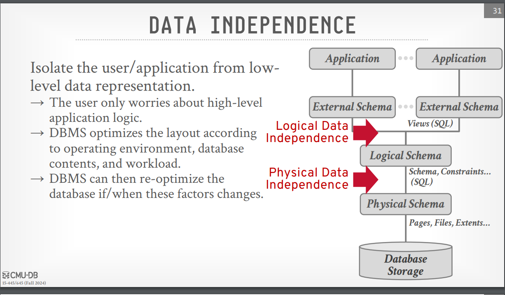
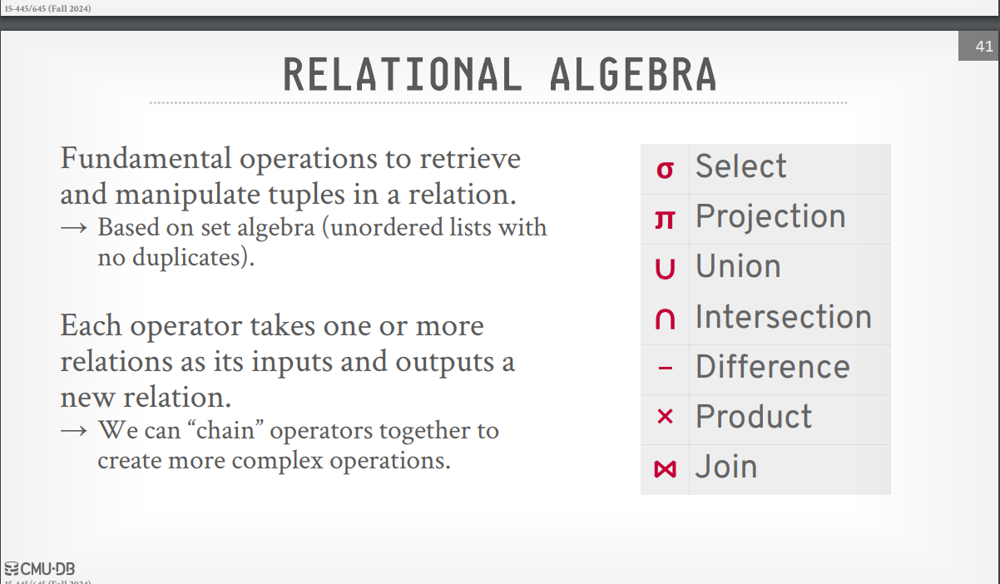

# Database

A database is an organized collection of inter-related data that models some aspect of the real-world (e.g modeling the students in a class or a digital music store). 

--- 

#  Flat File Strawman

A **Flat File Strawman** refers to a simplistic proposal or initial model for data storage using flat files, which are basic text files organized in rows and columns, such as CSV or TXT files. This approach is often utilized as a starting point in discussions or designs to explore data storage concepts without the complexities of relational databases. The term "strawman" signifies that this model is not fully developed and serves as a basis for further exploration, debate, or refinement before adopting a more sophisticated data management solution.

---

## Issues with Flat Files 

**Issues with Flat Files** refer to the various challenges and limitations encountered when using flat files for data storage in applications. Flat files, such as CSV files, are simple text files where data is organized in a tabular format, with records separated by new lines and attributes within records separated by commas. While flat files are easy to implement and manage for small datasets, they pose significant problems as the volume of data grows or as the complexity of data relationships increases.

### 1.Data Integrity
> Ensuring consistency and validity of data can be challenging, especially when multiple entries relate to the same entity. For example, ensuring that artist details remain accurate across multiple albums.

### 2. Implementation
> Locating specific records can be inefficient, and integrating with new applications or systems can be complicated, particularly if they operate on different platforms. Furthermore, concurrent write operations can lead to conflicts and data corruption.

### 3. Durability
> Flat files are vulnerable to data loss in the event of system failures during updates, and maintaining high availability through replication across multiple systems can be complex and resource-intensive.
  

--- 

# Database Management System

A **Database Management System (DBMS)** is software that allows applications to store and analyze information in a database. A general-purpose DBMS supports the definition, creation, querying, updating, and administration of databases in accordance with some data model.

---

# Data Model

A **data model** is a collection of concepts for describing the data in a database. A **schema** is a description of a particular collection of data, using a given data model.

---

### Types of Data Models

1. **Hierarchical Data Model**  
   Organizes data in a tree-like structure with parent-child relationships. Each parent can have multiple children, but each child has only one parent.  
   *Example:* File systems, organizational structures.

2. **Network Data Model**  
   Allows for more complex relationships with multiple parent-child links. Represents data as a graph, with nodes (entities) and edges (relationships).  
   *Example:* Telecommunications networks.

3. **Relational Data Model**  
   Organizes data into tables (relations) with rows and columns. Each table represents an entity, and relationships are established through foreign keys.  
   *Example:* SQL databases (e.g., MySQL, PostgreSQL).

4. **Object-oriented Data Model**  
   Combines data and behavior in objects, allowing for inheritance and encapsulation. Suitable for complex data structures and relationships.  
   *Example:* Object-oriented databases (e.g., MongoDB).

5. **Entity-Relationship Model (ER Model)**  
   Visual representation of data entities and their relationships, primarily used for database design and conceptualization.  
   *Example:* ER diagrams in database design.

6. **Document Data Model**  
   Stores data in documents, typically in formats like JSON or XML. Each document can have a varying structure, allowing flexibility.  
   *Example:* NoSQL databases (e.g., MongoDB, CouchDB).

7. **Key-Value Data Model**  
   Stores data as a collection of key-value pairs, where each key is unique. Ideal for fast lookups and simple data structures.  
   *Example:* Key-value stores (e.g., Redis, DynamoDB).

8. **Column-Family Data Model**  
   Organizes data into column families rather than rows, allowing for efficient storage and retrieval. Each column family can store different types of data.  
   *Example:* Columnar databases (e.g., Apache Cassandra).

9. **Graph Data Model**  
   Represents data as nodes and edges, capturing relationships and interactions between entities. Optimized for connected data and complex queries.  
   *Example:* Graph databases (e.g., Neo4j).

---

# Relational Model

The relational model defines a database abstraction based on relations to avoid maintenance overhead.

## Key Ideas

- **Simple Data Structures**: The database is stored in simple data structures called relations.
- **Physical Storage**: The actual physical storage of data is determined by the DBMS implementation.
- **High-Level Language Access**: Data is accessed through a high-level language, allowing the DBMS to determine the most efficient execution strategy.

## Concepts of the Relational Data Model

1. **Structure**:
    
    - Defines the relations and their contents, independent of their physical representation.
2. **Integrity**:
    
    - Ensures that the contents of the database satisfy specific constraints.
3. **Manipulation**:
    
    - Provides a programming interface for accessing and modifying the contents of the database.

## Data Independence

## Relational Model: Keys and Constraints

### 1. Primary Keys

- **Definition**: A primary key is a unique identifier for a record in a database table. It ensures that each entry in the table can be uniquely identified.
- **Characteristics**:
    - Must contain unique values for each record.
    - Cannot contain NULL values.
    - A table can have only one primary key, which may consist of a single or multiple columns (composite key).

### 2. Foreign Keys

- **Definition**: A foreign key is a field (or a collection of fields) in one table that uniquely identifies a row in another table. It creates a relationship between the two tables.
- **Characteristics**:
    - A foreign key in one table points to a primary key in another table.
    - It allows for establishing and enforcing referential integrity between the two tables.
    - Foreign keys can contain duplicate values and can have NULL values.

### 3. Constraints

- **Definition**: Constraints are rules applied to table columns that ensure the accuracy and reliability of the data in the database.
- **Types of Constraints**:
    - **NOT NULL**: Ensures that a column cannot have a NULL value.
    - **UNIQUE**: Ensures that all values in a column are different from one another.
    - **CHECK**: Ensures that all values in a column satisfy a specific condition.
    - **DEFAULT**: Sets a default value for a column when no value is specified.

---

# Data Manipulation Languages (DMLs)

Methods to store and retrieve information from a database. There are two classes of languages for this: 
-  Procedural: The query specifies the (high-level) strategy the DBMS should use to find the desired result based on sets / bags. For example, use a for loop to scan all records and count how many records are there to retrieve the number of records in the table.
- Non-Procedural (Declarative): The query specifies only what data is wanted and not how to find it. For example, we can use SQL SELECT COUNT(*) FROM artist to count how many records are there in the table.

---

# Relational Algebra

Relational Algebra is a set of fundamental operations to retrieve and manipulate tuples in a relation. Each operator takes in one or more relations as inputs, and outputs a new relation. To write queries we can ”chain” these operators together to create more complex operations.

 
---

## Relational Algebra Operations

This document provides an overview of key operations in relational algebra, which is used for querying and manipulating relational databases.

### Selection (σ)

Selection is an operation that takes a relation and outputs a subset of tuples that satisfy a specified selection predicate.

**Example**:  
If we have a relation `Students` and we want to select students older than 20:

σ_Age > 20(Students)

---

### Projection (π)

Projection is an operation that takes a relation and outputs a new relation containing only specified attributes.

**Example**:  
To project only the names and majors of students:

π_Name, Major(Students)

---

### Union (∪)

Union combines the tuples from two relations and removes duplicates. Both relations must have the same attributes.

**Example**:  
If `UndergraduateStudents` and `GraduateStudents` have the same structure, the operation would be:

UndergraduateStudents ∪ GraduateStudents

---

### Intersection (∩)

Intersection returns the tuples that are present in both relations.

**Example**:  
To find students enrolled in both the CS and Math courses:

Students_CS ∩ Students_Math

---

### Difference (−)

Difference returns the tuples that are in the first relation but not in the second.

**Example**:  
To find students who are not enrolled in any Math courses:

Students − Students_Math

---

### Product (×)

Product (Cartesian product) combines all tuples from two relations, producing a new relation that contains every possible pair of tuples.

**Example**:  
If we have relations `Students` and `Courses`, the operation would be:

Students × Courses

---

### Join (⨝)

Join combines tuples from two relations based on a related attribute. There are several types of joins:

#### 1. Inner Join
Returns only the tuples that have matching values in both relations.

**Example**:  
To join `Students` and `Enrollments` on the `StudentID`:

Students ⨝ Enrollments

#### 2. Left Outer Join
Returns all tuples from the left relation and matching tuples from the right relation. If there is no match, null values are returned.

#### 3. Right Outer Join
Returns all tuples from the right relation and matching tuples from the left relation. If there is no match, null values are returned.

#### 4. Full Outer Join
Returns all tuples when there is a match in either relation. Null values are filled in when there is no match.

**Example**:  
To perform a left outer join between `Students` and `Enrollments`:

Students ⨝ Enrollments (Left Outer)

---

