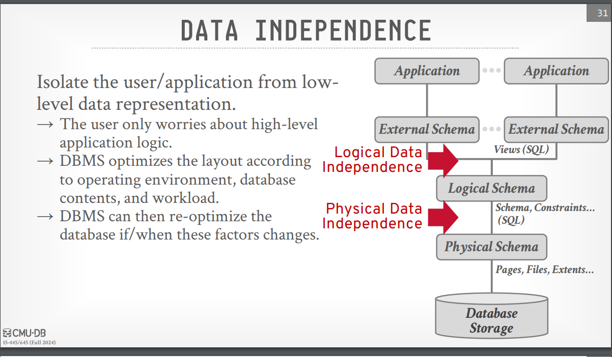

# Topics:

1. [Database](#database) 
2. [Purpose of Database Systems](#purpose-of-database-systems) 
3. [Flat File Strawman](#flat-file-strawman)
4. [View of Data](#view-of-data) 
5. [Database Languages](#database-languages) 
6. [Database Design Process](#database-design-process) 
7. [Data Storage and Querying](#data-storage-and-querying) 
8. [Database Architecture](#database-architecture)
9. [Database Users and Administrators](#database-users-and-administrators) 
10. [CHAPTER 2](#chapter-2)
 ---

# Database

A database is an organized collection of inter-related data that models some aspect of the real-world (e.g modeling the students in a class or a digital music store). 

--- 

# Purpose of Database Systems

A database system aims to address the limitations of the traditional file-processing systems by providing a more efficient, reliable, and flexible way to manage data. Some of the key purposes of a database system include:

- **Data management**: Centralized control over data, ensuring consistency and minimizing redundancy.
- **Data access**: Simplifies data access through query languages like SQL, eliminating the need for custom code for each query.
- **Data sharing**: Allows multiple users or applications to share data concurrently without conflicts.
- **Data integrity**: Ensures that data satisfies integrity constraints, preventing errors and inconsistencies.
- **Data security**: Provides mechanisms to control data access and maintain data privacy, enabling fine-grained security policies.
- **Backup and recovery**: Protects data from system failures by providing backup and recovery solutions.

A file-processing system is supported by a conventional operating system. The system stores permanent records in various files, and it requires different application programs to extract records from and add records to the appropriate files.

> The file-processing system has several major disadvantages:

- **Data redundancy and inconsistency**: The same data may be duplicated in multiple places, leading to inconsistency.
- **Difficulty in accessing data**: Custom programs are often required to retrieve specific data.
- **Data isolation**: Data is scattered in different files, making it difficult to retrieve efficiently.
- **Integrity problems**: Integrity constraints, like ensuring all records have a valid value, are hard to enforce.
- **Atomicity problems**: Failures may leave the data in an inconsistent state, and ensuring atomic transactions is challenging.
- **Concurrent-access anomalies**: Multiple users accessing the data simultaneously can lead to conflicts or corrupted data.
- **Security problems**: Hard to enforce fine-grained security policies on a file-based system.

---

#  Flat File Strawman

A **Flat File Strawman** refers to a simplistic proposal or initial model for data storage using flat files, which are basic text files organized in rows and columns, such as CSV or TXT files. This approach is often utilized as a starting point in discussions or designs to explore data storage concepts without the complexities of relational databases. The term "strawman" signifies that this model is not fully developed and serves as a basis for further exploration, debate, or refinement before adopting a more sophisticated data management solution.

---

## Issues with Flat Files 

**Issues with Flat Files** refer to the various challenges and limitations encountered when using flat files for data storage in applications. Flat files, such as CSV files, are simple text files where data is organized in a tabular format, with records separated by new lines and attributes within records separated by commas. While flat files are easy to implement and manage for small datasets, they pose significant problems as the volume of data grows or as the complexity of data relationships increases.

### 1.Data Integrity
> Ensuring consistency and validity of data can be challenging, especially when multiple entries relate to the same entity. For example, ensuring that artist details remain accurate across multiple albums.

### 2. Implementation
> Locating specific records can be inefficient, and integrating with new applications or systems can be complicated, particularly if they operate on different platforms. Furthermore, concurrent write operations can lead to conflicts and data corruption.

### 3. Durability
> Flat files are vulnerable to data loss in the event of system failures during updates, and maintaining high availability through replication across multiple systems can be complex and resource-intensive.
  

--- 

# Database Management System

A **Database Management System (DBMS)** is software that allows applications to store and analyze information in a database. A general-purpose DBMS supports the definition, creation, querying, updating, and administration of databases in accordance with some data model.

---

# View of Data

A major purpose of a database system is to provide users with an abstract view of the data. The system hides certain details about how the data are stored and maintained, allowing users to interact with data without needing to understand the complexities of its storage.

## Data Abstraction

For the system to be usable, it must retrieve data efficiently. Designers use complex data structures to represent data in the database to ensure this efficiency. To simplify users’ interactions with the system, data abstraction is categorized into three levels:

- **Physical level**: The lowest level of abstraction that describes how data is physically stored in the database. This level details the complex low-level data structures such as indexes, storage blocks, and file organization.

- **Logical level**: The middle level of abstraction that describes what data is stored in the database and the relationships between the different data elements. This level defines tables, fields, and data types, but hides details of how data is physically stored.

- **View level**: The highest level of abstraction that describes only a part of the entire database. It defines user-specific views of the data, often showing only relevant information to the user or application while hiding other details.

Each level of abstraction ensures that users or programs only deal with the relevant data and ignore the complexities of other layers, improving efficiency and ease of use.

---

## Data Model

A **data model** is a collection of concepts for describing the data in a database. A **schema** is a description of a particular collection of data, using a given data model.

---

### Types of Data Models

1. **Hierarchical Data Model**  
   Organizes data in a tree-like structure with parent-child relationships. Each parent can have multiple children, but each child has only one parent.  
   *Example:* File systems, organizational structures.

2. **Network Data Model**  
   Allows for more complex relationships with multiple parent-child links. Represents data as a graph, with nodes (entities) and edges (relationships).  
   *Example:* Telecommunications networks.

3. **Relational Data Model**  
   Organizes data into tables (relations) with rows and columns. Each table represents an entity, and relationships are established through foreign keys.  
   *Example:* SQL databases (e.g., MySQL, PostgreSQL).

4. **Object-oriented Data Model**  
   Combines data and behavior in objects, allowing for inheritance and encapsulation. Suitable for complex data structures and relationships.  
   *Example:* Object-oriented databases (e.g., MongoDB).

5. **Entity-Relationship Model (ER Model)**  
   Visual representation of data entities and their relationships, primarily used for database design and conceptualization.  
   *Example:* ER diagrams in database design.

6. **Document Data Model**  
   Stores data in documents, typically in formats like JSON or XML. Each document can have a varying structure, allowing flexibility.  
   *Example:* NoSQL databases (e.g., MongoDB, CouchDB).

7. **Key-Value Data Model**  
   Stores data as a collection of key-value pairs, where each key is unique. Ideal for fast lookups and simple data structures.  
   *Example:* Key-value stores (e.g., Redis, DynamoDB).

8. **Column-Family Data Model**  
   Organizes data into column families rather than rows, allowing for efficient storage and retrieval. Each column family can store different types of data.  
   *Example:* Columnar databases (e.g., Apache Cassandra).

9. **Graph Data Model**  
   Represents data as nodes and edges, capturing relationships and interactions between entities. Optimized for connected data and complex queries.  
   *Example:* Graph databases (e.g., Neo4j).

---

# Database Languages

A database system provides two key languages:

- **Data-Definition Language (DDL)**: Used to specify the database schema.
- **Data-Manipulation Language (DML)**: Used to express database queries and updates.

---

## Data Manipulation Languages (DMLs)

A **Data Manipulation Language (DML)** enables users to access or manipulate data organized by the appropriate data model. DMLs allow for the following types of access:

- **Retrieval** of information stored in the database.
- **Insertion** of new information into the database.
- **Deletion** of information from the database.
- **Modification** of existing information in the database.

> There are two types of DMLs:

- **Procedural DML**: Specifies what data is needed and the strategy the DBMS should use to retrieve it. For example, using a loop to scan records manually and count them.
- **Non-Procedural (Declarative) DML**: Specifies only what data is required without defining how to retrieve it. For example, using the SQL query `SELECT COUNT(*) FROM artist` to count the number of records in a table.

---

## Data-Definition Language (DDL)

A **Data-Definition Language (DDL)** is used to define the structure of the database. It specifies the database schema through a set of definitions. In addition to specifying the schema, DDL also allows users to define various properties of the data, such as:

- **Data types**: Defining the type of data (e.g., integer, string) stored in each column.
- **Integrity constraints**: Ensuring the correctness and validity of the data, such as setting a field to be unique or not null.
- **Table creation**: Defining tables, columns, and their relationships.
- **Index creation**: Defining indexes to speed up data retrieval.
- **Schema alterations**: Making modifications to the schema as needed.

> DDL commands, such as `CREATE`, `ALTER`, and `DROP`, are used to define and modify the structure of the database.

---
# Database Design Process

The database design process begins with a high-level data model that provides a conceptual framework for specifying user data requirements and structuring the database to meet those needs.

## Phases of Database Design:

### 1. User Requirement Specification
- The designer interacts extensively with domain experts and users to fully characterize their data needs.
- The outcome is a detailed specification of user requirements.

### 2. Conceptual Schema Development
- The designer selects a data model and translates user requirements into a conceptual schema.
- This schema offers a comprehensive overview of the enterprise, ensuring all data requirements are satisfied and free of conflicts.
- Redundant features are removed, focusing on data descriptions and relationships rather than physical storage details.

### 3. Defining Attributes and Tables
- In the relational model, the designer decides on attributes to capture and groups them into tables.
- The "what" part (which attributes to include) involves business decisions, while the "how" part (how to organize data) is a technical problem.
- Two primary methods to tackle this are:
  - Using the **Entity-Relationship (ER) Model**.
  - Applying **Normalization** algorithms to generate tables from the set of attributes.

### 4. Functional Requirements Specification
- A fully developed conceptual schema outlines the functional requirements of the enterprise.
- Users specify operations on the data, such as modifying, searching, retrieving, and deleting data.
- The designer ensures the schema aligns with these functional requirements.

### 5. Logical and Physical Design
- The process transitions to two final phases:
  - **Logical Design**: Mapping the conceptual schema to the implementation data model used by the database system.
  - **Physical Design**: Specifying the physical features of the database, including file organization and internal structures.

---
## The Entity-Relationship Model

The Entity-Relationship (E-R) data model is a framework for describing the logical structure of a database using basic objects known as **entities** and the relationships among them.

### Key Concepts
#### Entities
- An **entity** is a distinguishable object in the real world, such as a person or a bank account.
- Each entity is described by a set of **attributes**. For example:
  - **Department Entity:** Attributes may include `dept_name`, `building`, and `budget`.
  - **Instructor Entity:** Attributes may include `ID`, `name`, and `salary`. The attribute `ID` uniquely identifies each instructor.

#### Relationships
- A **relationship** is an association among multiple entities. For example, the **member** relationship associates an instructor with their department.
- Sets of entities and relationships of the same type are called **entity sets** and **relationship sets**, respectively.

#### E-R Diagrams
The overall logical structure (schema) of a database can be visually represented using an **E-R diagram**. In E-R diagrams:
- **Entity sets** are represented by rectangular boxes, with the entity set name at the top and attributes listed below.
- **Relationship sets** are depicted by diamonds connecting related entity sets, with the relationship name inside the diamond.

#### Constraints
The E-R model includes certain constraints that the database must adhere to. One important constraint is **mapping cardinalities**, which specify the number of entities that can be associated with another entity through a relationship set. For example, if each instructor can be associated with only one department, this constraint can be represented in the E-R model.

---
## Normalization

Normalization is a method for designing a relational database aimed at generating a set of relation schemas that minimize redundancy while facilitating easy information retrieval. The process focuses on creating schemas that conform to appropriate normal forms.

### Goals of Normalization
- **Minimize Redundancy:** Store information without unnecessary repetition.
- **Facilitate Retrieval:** Allow for easy access to the stored information.

### Key Concepts
To determine whether a relation schema is in a desirable normal form, additional information about the real-world enterprise being modeled is required. The most common approach to provide this information is through **functional dependencies**.

### Issues with Poor Database Design
Bad database designs may exhibit undesirable properties, including:
- **Repetition of Information:** Redundant data entries can lead to inconsistencies.
- **Inability to Represent Certain Information:** Certain data relationships may be difficult or impossible to model.

Normalization helps address these issues, ensuring that the database structure effectively supports the necessary operations and relationships.

---
# Data Storage and Querying

A database system is divided into modules that manage different responsibilities. The main components of a database system include the **Storage Manager** and the **Query Processor**.

## Storage Manager
The **Storage Manager** is crucial as databases require significant storage space, ranging from hundreds of gigabytes to terabytes. Data is stored on disks, and movement between disk storage and main memory must be minimized due to the slower speed of disk operations compared to the CPU.

### Responsibilities of the Storage Manager:
- Provides an interface between low-level data and application programs.
- Interacts with the file manager to manage raw data on disk.
- Translates Data Manipulation Language (DML) statements into low-level file-system commands.

### Components of the Storage Manager:
1. **Authorization and Integrity Manager:** Ensures integrity constraints are met and verifies user access.
2. **Transaction Manager:** Maintains database consistency during system failures and manages concurrent transactions.
3. **File Manager:** Manages disk space allocation and data structures for stored information.
4. **Buffer Manager:** Fetches data from disk to main memory and decides which data to cache, enabling handling of larger data sizes than available memory.

### Data Structures Implemented:
- **Data Files:** Store the actual database.
- **Data Dictionary:** Contains metadata about the database structure, particularly the schema.
- **Indices:** Allow fast access to data items, similar to a book index, providing pointers to specific records.

## Query Processor
The **Query Processor** simplifies and facilitates data access for users, enabling them to work at a logical level without dealing with physical implementation details.

### Components of the Query Processor:
1. **DDL Interpreter:** Interprets Data Definition Language (DDL) statements and updates the data dictionary.
2. **DML Compiler:** Translates DML statements into evaluation plans of low-level instructions for the query evaluation engine, while optimizing the plan for efficiency.
3. **Query Evaluation Engine:** Executes the low-level instructions generated by the DML compiler.

---

# Database Architecture

Database architecture encompasses the various components of a database system and their interconnections. It is influenced by the underlying computer system and can be categorized into different types:

## Types of Database Systems
1. **Centralized Systems:** All components run on a single machine.
2. **Client-Server Systems:** One server executes tasks on behalf of multiple clients.
3. **Distributed Databases:** Data is spread across multiple geographically separated machines.
4. **Parallel Architectures:** Designed to exploit parallel computing capabilities.

### Architecture Overview
- Most users access the database system remotely via a network, leading to a distinction between **client machines** (user workstations) and **server machines** (where the database operates).
  
## Application Partitioning
Database applications can be organized into two or three tiers:

### Two-Tier Architecture
- **Client Machine:** Hosts the application and communicates directly with the database system using query language statements.
- **Server Machine:** Runs the database system, accessed through Application Program Interface (API) standards like ODBC and JDBC.

### Three-Tier Architecture
- **Client Machine:** Acts as a front end, not making direct database calls.
- **Application Server:** Mediates between the client and database, managing business logic.
- **Database System:** Accessed by the application server for data retrieval and manipulation.

This architecture is more suitable for larger applications where business logic can be centralized in the application server.

---

# Database Users and Administrators

There are four different types of database-system users, differentiated by how they interact with the system:

- **Naïve users**: Users who interact with the system through predefined programs or interfaces.
  
- **Application programmers**: Computer professionals who write application programs that interact with the database.

- **Sophisticated users**: Users who interact with the system without writing programs. They use database query languages or tools like data analysis software to form their requests.

- **Specialized users**: Sophisticated users who develop specialized database applications that fall outside the traditional data-processing framework.

---

## Database Administrator (DBA)

One of the key reasons for using a DBMS is to centralize control over both the data and the programs that access it. The individual responsible for this central control is called the **Database Administrator (DBA)**. The functions of a DBA include:

- **Schema definition**: The DBA creates the original database schema by executing a set of data definition statements in the DDL (Data Definition Language).

- **Storage structure and access-method definition**: The DBA defines how the data will be stored and how it can be accessed efficiently.

- **Schema and physical-organization modification**: The DBA updates the schema and physical data organization as the needs of the organization evolve or to enhance performance.
-  **Granting of authorization for data access**: The DBA grants or revokes access rights to different users, ensuring proper security and control over sensitive data.
-  **Routine maintenance**: The DBA performs regular database maintenance tasks such as backups, performance tuning, and ensuring data integrity.

---

# CHAPTER 2

# Topics:
1. [Relational Model](#relational-model)
2. [Relational Algebra](#relational-algebra)
3. [Summary](#summary)

# Relational Model

The relational model defines a database abstraction based on relations to avoid maintenance overhead.

## Key Ideas

- **Simple Data Structures**: The database is stored in simple data structures called relations.
- **Physical Storage**: The actual physical storage of data is determined by the DBMS implementation.
- **High-Level Language Access**: Data is accessed through a high-level language, allowing the DBMS to determine the most efficient execution strategy.

## Concepts of the Relational Data Model

1. **Structure**:
    
    - Defines the relations and their contents, independent of their physical representation.
2. **Integrity**:
    
    - Ensures that the contents of the database satisfy specific constraints.
3. **Manipulation**:
    
    - Provides a programming interface for accessing and modifying the contents of the database.

## Data Independence

## Relational Model: Keys and Constraints

### 1. Primary Keys
- **Definition**: A primary key is a unique identifier for a record in a database table, ensuring that each entry can be uniquely identified.
- **Characteristics**:
    - Must contain unique values for each record.
    - Cannot contain NULL values.
    - A table can have only one primary key, which may consist of a single or multiple columns (composite key).

### 2. Foreign Keys
- **Definition**: A foreign key is a field (or a collection of fields) in one table that uniquely identifies a row in another table, creating a relationship between the two tables.
- **Characteristics**:
    - A foreign key in one table points to a primary key in another table.
    - It allows for establishing and enforcing referential integrity between the two tables.
    - Foreign keys can contain duplicate values and can have NULL values.

### 3. Superkeys
- **Definition**: A superkey is a set of one or more attributes that, taken collectively, can uniquely identify a record in a table.
- **Characteristics**:
    - Superkeys may contain additional attributes beyond what is necessary for uniqueness.
    - Every primary key is a superkey, but not all superkeys are primary keys.

### 4. Candidate Keys
- **Definition**: Candidate keys are minimal superkeys, meaning they have no unnecessary attributes. Each candidate key can uniquely identify a record in a table.
- **Characteristics**:
    - A table can have multiple candidate keys, but one of them is chosen to be the primary key.
    - Each candidate key must be unique and non-null.

### 5. Constraints
- **Definition**: Constraints are rules applied to table columns that ensure the accuracy and reliability of the data in the database.
- **Types of Constraints**:
    - **NOT NULL**: Ensures that a column cannot have a NULL value.
    - **UNIQUE**: Ensures that all values in a column are different from one another.
    - **CHECK**: Ensures that all values in a column satisfy a specific condition.
    - **DEFAULT**: Sets a default value for a column when no value is provided.

---

# Relational Algebra

Relational Algebra is a set of fundamental operations to retrieve and manipulate tuples in a relation. Each operator takes in one or more relations as inputs, and outputs a new relation. To write queries we can ”chain” these operators together to create more complex operations.

 
---

## Relational Algebra Operations

This document provides an overview of key operations in relational algebra, which is used for querying and manipulating relational databases.

### Selection (σ)

Selection is an operation that takes a relation and outputs a subset of tuples that satisfy a specified selection predicate.

**Example**:  
If we have a relation `Students` and we want to select students older than 20:

σ_Age > 20(Students)

---

### Projection (π)

Projection is an operation that takes a relation and outputs a new relation containing only specified attributes.

**Example**:  
To project only the names and majors of students:

π_Name, Major(Students)

---

### Union (∪)

Union combines the tuples from two relations and removes duplicates. Both relations must have the same attributes.

**Example**:  
If `UndergraduateStudents` and `GraduateStudents` have the same structure, the operation would be:

UndergraduateStudents ∪ GraduateStudents

---

### Intersection (∩)

Intersection returns the tuples that are present in both relations.

**Example**:  
To find students enrolled in both the CS and Math courses:

Students_CS ∩ Students_Math

---

### Difference (−)

Difference returns the tuples that are in the first relation but not in the second.

**Example**:  
To find students who are not enrolled in any Math courses:

Students − Students_Math

---

### Product (×)

Product (Cartesian product) combines all tuples from two relations, producing a new relation that contains every possible pair of tuples.

**Example**:  
If we have relations `Students` and `Courses`, the operation would be:

Students × Courses

---

### Join (⨝)

Join combines tuples from two relations based on a related attribute. There are several types of joins:

#### 1. Inner Join
Returns only the tuples that have matching values in both relations.

**Example**:  
To join `Students` and `Enrollments` on the `StudentID`:

Students ⨝ Enrollments

#### 2. Left Outer Join
Returns all tuples from the left relation and matching tuples from the right relation. If there is no match, null values are returned.

#### 3. Right Outer Join
Returns all tuples from the right relation and matching tuples from the left relation. If there is no match, null values are returned.

#### 4. Full Outer Join
Returns all tuples when there is a match in either relation. Null values are filled in when there is no match.

**Example**:  
To perform a left outer join between `Students` and `Enrollments`:

Students ⨝ Enrollments (Left Outer)

---

# Summary

- **Relational Data Model**: The relational data model is based on a collection of tables. Users of the database system can query these tables, insert new tuples, delete tuples, and update (modify) tuples using various languages for expressing these operations.

- **Schema vs. Instance**: The schema of a relation refers to its logical design, while an instance of the relation refers to its contents at a specific point in time. The schema includes attributes, types of attributes, and constraints such as primary and foreign key constraints.

- **Keys**:
    - **Superkey**: A superkey is a set of one or more attributes whose values uniquely identify tuples in the relation.
    - **Candidate Key**: A candidate key is a minimal superkey; it contains no unnecessary attributes. One of the candidate keys is selected as the primary key.
    - **Foreign Key**: A foreign key is a set of attributes in a referencing relation that guarantees the values of the foreign key attributes match the primary key values in the referenced relation.

- **Schema Diagram**: A schema diagram is a pictorial representation of the database schema, showing the relations, their attributes, primary keys, and foreign keys.

- **Relational Query Languages**: Relational query languages define a set of operations that operate on tables and produce tables as results. These operations can be combined to express desired queries.

- **Relational Algebra**: The relational algebra provides a set of operations that take one or more relations as input and return a relation as output. Practical query languages like SQL are based on relational algebra but include additional syntactic features.

