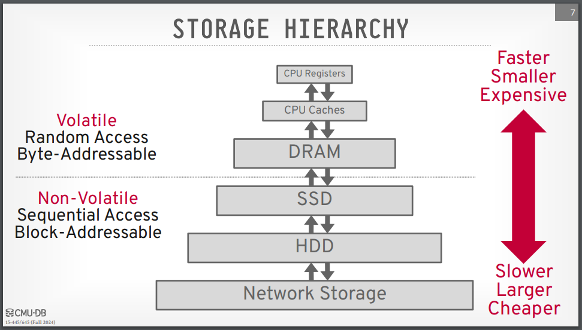
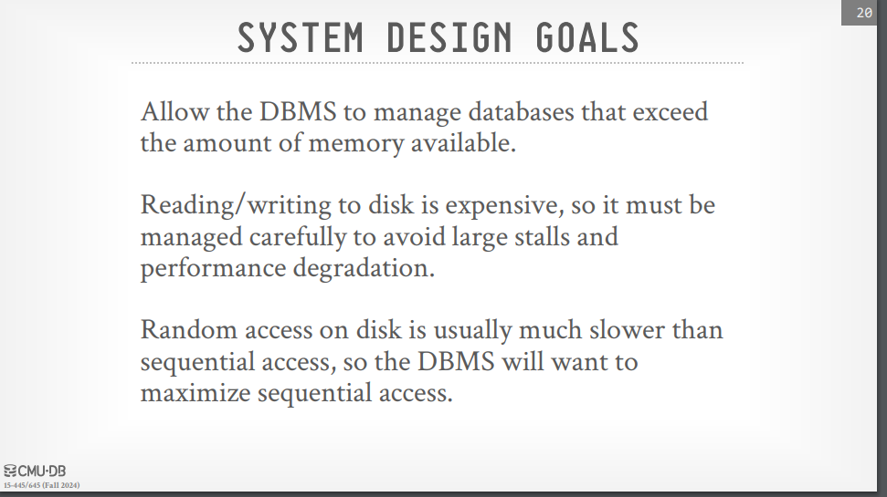
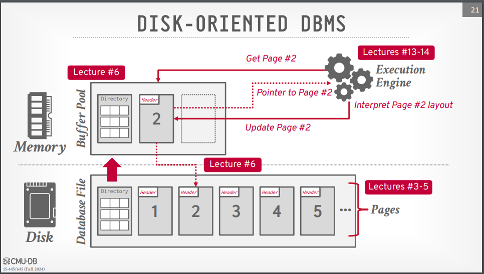
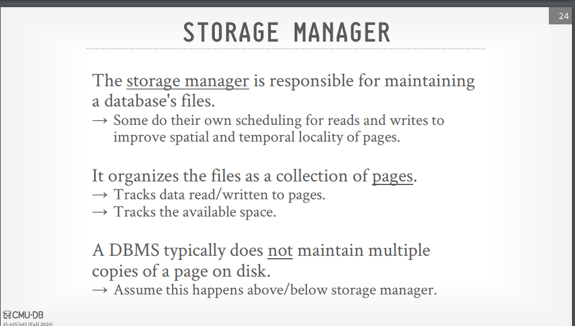
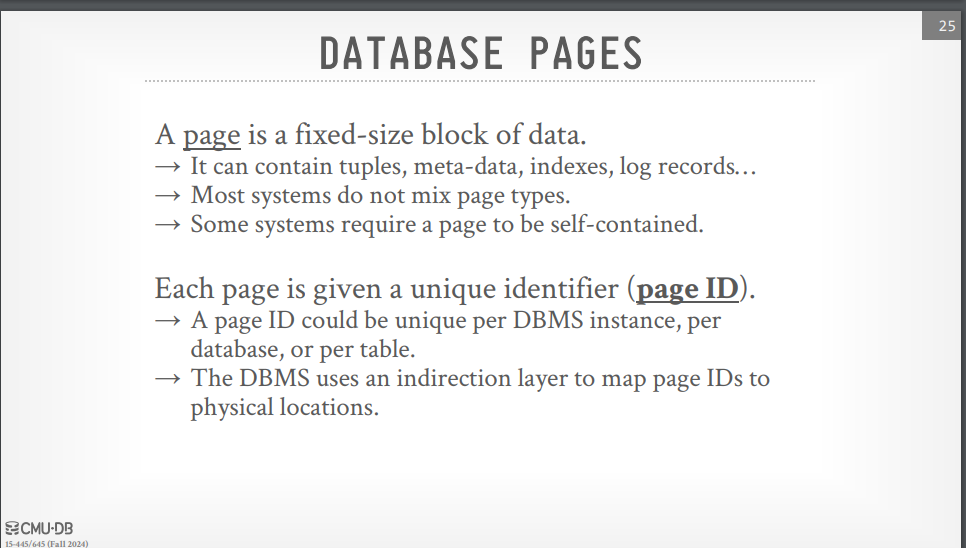
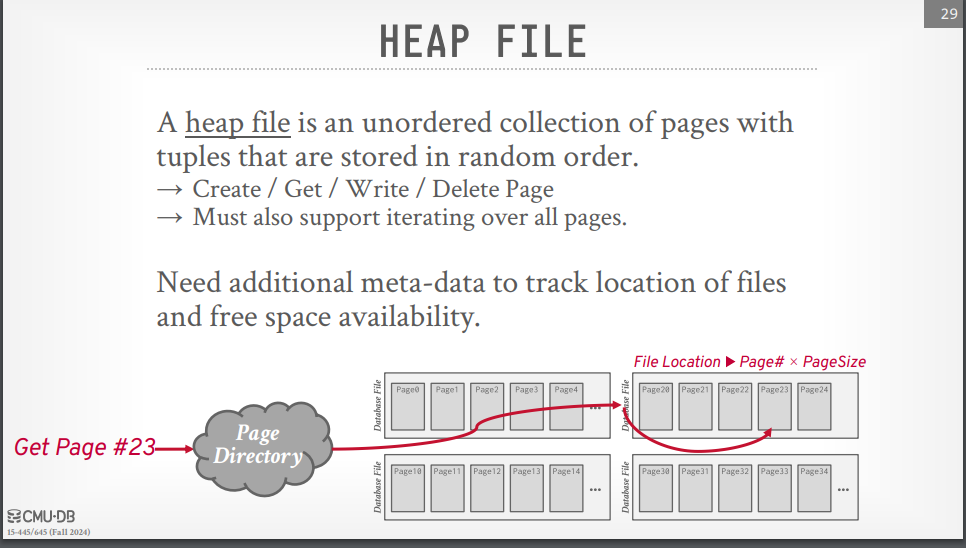
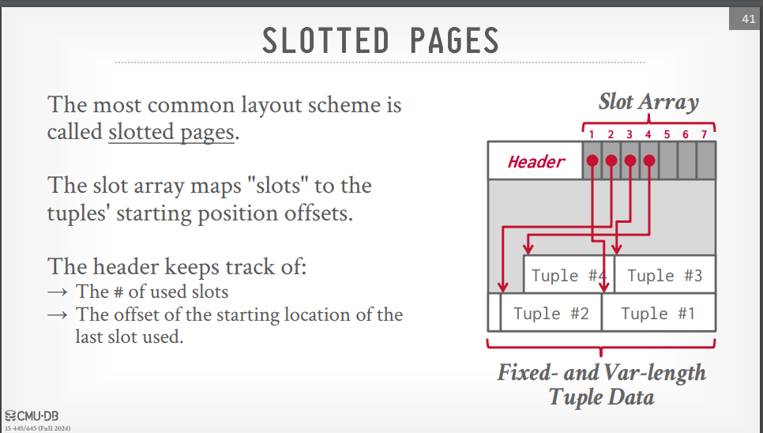

# Topics
## CHAPTER 12
1. [Physical Storage Systems](#1-physical-storage-systems)
2. [Storage Interfaces](#2-storage-interfaces)
3. [Magnetic Disks](#3-magnetic-disks)
4. [Flash Memory](#4-flash-memory)
5. [Storage Types in DBMS](#5-storage-types-in-dbms)
6. [System Design Goals](#6-system-design-goals)
7. [Disk-Oriented DBMS Overview](#7-disk-oriented-dbms-overview)
8. [DBMS vs. OS](#8-dbms-vs-os)


## CHAPTER 13
1. [Database Storage Architecture](#1-database-storage-architecture)
2. [File Organization](#2-file-organization-1)
3. [Organization of Records in Files](#3-organization-of-records-in-files)
4. [Database Pages](#4-database-pages)
5. [Heap File](#5-heap-file)
6. [Page Layout](#6-page-layout)
7. [Tuple Layout](#7-tuple-layout)
    

# 1. Physical Storage Systems

Several types of data storage exist in most computer systems, classified by:
- Speed of data access
- Cost per unit of data
- Reliability

Below are common storage media:

## 1. Cache
- **Fastest** and **most expensive** form of storage.
- Managed by hardware; small in size.
- Not managed by the database system, but database implementors consider cache effects in designing query processing data structures and algorithms.

## 2. Main Memory
- Used for **operating data**.
- General-purpose machine instructions operate on main memory.
- **Volatile**: Contents are lost during power failure or system crash.
- Too **expensive** or **small** for large databases, but enterprise databases often fit in main memory.

## 3. Flash Memory
- **Non-volatile**: Retains data even if the power is off.
- Lower cost per byte than main memory, but higher than magnetic disks.
- Widely used in devices like **cameras, cell phones**, and **USB drives**.
- Increasingly used as a **replacement** for magnetic disks in personal computers and servers.
- A **solid-state drive (SSD)** uses flash memory and provides a block-oriented interface for data access (block sizes typically range from 512 bytes to 8 KB).

## 4. Magnetic-Disk Storage (HDD)
- Primary medium for **long-term online storage** of data.
- **Non-volatile**: Survives power failures and system crashes, though rare disk failures can occur.
- Data must be moved to **main memory** for access, and modified data must be written back to the disk.
- **Slower** than SSDs but **cheaper**.

## 5. Optical Storage (DVD)
- Data written and read using **laser light**.
- Primarily used for **video storage**, but can store digital data such as **database backups**.
- **Not suitable** for active databases due to slow access times.
- Types of DVDs:
  - **Read-only** (factory-produced)
  - **Write-once** (WORM: Write-once, read-many)
  - **Rewritable** (multiple times)

## 6. Tape Storage
- Used primarily for **backup** and **archival data**.
- **Sequential-access** storage: Requires access from the beginning, resulting in slow data retrieval (tens to hundreds of seconds).
- Tapes are **removable**, and individual tapes are cheaper than disks of the same capacity.
- Common use cases include **archival storage** (e.g., large video files, scientific data).


## Hierarchy of Storage Media

The storage media are organized into a hierarchy based on:
- **Speed**
- **Cost per bit**
- **Volatility**

### Levels of the Hierarchy:
1. **Primary Storage**: Fast and expensive (e.g., cache, main memory).
2. **Secondary Storage**: Online storage (e.g., flash memory, magnetic disks).
3. **Tertiary Storage**: Offline storage (e.g., tapes, optical-disk jukeboxes).

---
# 2. Storage Interfaces

- **Magnetic Disks & SSDs**: Connected to computer systems via high-speed interconnections. Common interfaces include:
  - **SATA**: 
    - SATA-3 supports up to 6 Gbps (600 MBps data transfer speed).
  - **SAS**: 
    - Typically used in servers, supports data transfer rates of up to 12 Gbps.
  - **NVMe**: 
    - Logical interface designed for SSDs, typically used with PCIe for high-speed internal data transfers.

- **Storage Area Network (SAN)**:
  - Disks can be connected remotely via high-speed networks.
  - Disks are often organized using **RAID** for reliability and presented as a single large disk to servers.
  - Common SAN interconnection technologies:
    - **iSCSI**: Sends SCSI commands over an IP network.
    - **Fiber Channel (FC)**: Supports transfer rates from 1.6 to 12 Gbps.
    - **InfiniBand**: Provides low latency, high-bandwidth communication.

- **Network Attached Storage (NAS)**:
  - Similar to SAN, but provides a **file system interface** using protocols like **NFS** or **CIFS**.

- **Cloud Storage**:
  - Stores data in the cloud, accessed via API.
  - High latency (tens to hundreds of milliseconds), making it less ideal for database storage but useful for object storage.


--- 
# 3. Magnetic Disks


## Overview
Magnetic disks are the primary form of secondary storage for modern computer systems. While capacities have increased steadily, large-scale applications still require massive amounts of storage. SSDs, with better performance, are increasingly competitive but remain more expensive than magnetic disks, which are preferred for storing large volumes of infrequently accessed data.

## Physical Characteristics of Magnetic Disks

- **Structure**: 
  - Disks consist of platters, which are circular metal or glass discs coated with magnetic material. Each platter has a read-write head that moves across the disk surface to access tracks.
  - Platters are mounted on a **spindle** and spun at speeds between 5400 to 15,000 RPM.
  - Data is stored in **sectors**, with each track being subdivided into multiple sectors. Outer tracks have more sectors than inner tracks.

- **Read-Write Head**:
  - Reads or writes data by magnetizing the disk surface. It floats just above the disk surface, a close proximity maintained by airflow generated by the spinning disk.
  - A **head crash** occurs when the head touches the disk surface, potentially damaging the disk.

- **Disk Arm and Cylinders**:
  - The read-write heads across multiple platters are mounted on a single **disk arm**, which moves together to access corresponding tracks on each platter, forming a **cylinder** of tracks.

- **Disk Controller**:
  - Interfaces between the computer and the disk drive, performing tasks such as moving the disk arm, reading/writing data, and managing **checksums** for data integrity.
  - Handles **remapping of bad sectors** by redirecting data to reserve sectors if corruption is detected.

## Performance Measures of Disks

- **Access Time**:
  - The time from when a request is made to when data transfer begins. 
  - It is the sum of **seek time** (moving the disk arm) and **rotational latency** (waiting for the desired sector to rotate under the head).
  - **Seek time** ranges from 2 to 20 milliseconds, while **rotational latency** is half the time for one full disk rotation, averaging 4 to 11 milliseconds per rotation.

- **Data-Transfer Rate**:
  - Refers to the speed at which data can be read from or written to the disk. Current disk systems offer transfer rates between 50 and 200 MB/s.
  - **Sequential access patterns** achieve higher transfer rates than **random access patterns**, where frequent seeks slow down the process.

- **Reliability (MTTF)**:
  - **Mean Time to Failure (MTTF)** estimates how long a disk will last without failure. Current disks claim MTTFs of 500,000 to 1,200,000 hours, but disks generally have a lifespan of about 5 years.

## Key Metrics

- **Access Time** = Seek Time + Rotational Latency
- **Data Transfer Rate** = Amount of data transferred per second (50 to 200 MB/s)
- **IOPS** (Input/Output Operations per Second): Number of random block accesses supported per second, ranging from 50 to 200.
- **MTTF**: Reliability measure; the time a disk is expected to run continuously without failure.


---
# 4. Flash Memory

## Types of Flash Memory
There are two types of flash memory:
- **NOR Flash**
- **NAND Flash** (predominantly used for data storage)

### NAND Flash Characteristics
- Reading from NAND flash requires fetching an entire page of data, typically 4096 bytes, into main memory.
- Pages in NAND flash are similar to sectors in magnetic disks.

## Solid-State Drives (SSDs)
- **SSDs** are built using NAND flash and provide the same block-oriented interface as disk storage.
- SSDs offer much faster random access than magnetic disks. The latency for retrieving a page of data ranges from **20 to 100 microseconds**, compared to **5 to 10 milliseconds** for magnetic disks.
- **Data Transfer Rates**:
  - SSDs: **500 MB/s** (SATA) to **3 GB/s** (NVMe PCIe)
  - Magnetic Disks: Maximum of **200 MB/s**
- SSDs also consume significantly **less power** than magnetic disks.

## Flash Memory Write Process
- Writing to a page in flash memory takes about **100 microseconds**.
- Pages cannot be directly overwritten once written. They need to be **erased** and rewritten. 
- Erase operations are performed on groups of pages, called **erase blocks**, which take **2 to 5 milliseconds**. Erase blocks typically range from **256 KB to 1 MB** and contain **128 to 256 pages**.

### Limitations
- Flash memory pages can only be erased a limited number of times (around **100,000 to 1,000,000** times).
- **Wear leveling**: Flash memory controllers distribute erase operations evenly to extend the lifespan of the memory.
- **Flash Translation Layer**: This software layer maps logical pages to physical pages and ensures flash memory operates like magnetic disk storage.

## Storage Class Memory
- **Storage class memory** allows direct access to individual bytes or words, avoiding the need to read/write in pages and erasing overhead.
- **3D-XPoint Memory**: A recently developed technology by Intel and Micron, it lies between main memory and flash memory in terms of cost, latency, and capacity.

## SSD Performance Metrics
1. **Random Block Reads**: For 4 KB blocks, SSDs can handle around **10,000 IOPS** (random reads per second), while NVMe PCIe SSDs can support over **350,000 random reads per second**.
2. **Sequential Data Transfer Rate**: For SATA SSDs, the rate is **400 to 500 MB/s**, and for NVMe SSDs, it ranges from **2 to 3 GB/s**.
3. **Random Block Writes**: SSDs can support about **40,000 IOPS** (without parallelism), and **100,000 IOPS** with parallelism (QD-32).

## Hybrid Drives
- **Hybrid Disk Drives** combine magnetic storage with flash memory as a cache for frequently accessed data, improving access times for such data.


---
# 5. Storage Types in DBMS

> **Note**
> => The DBMS assumes that the primary storage location of the database is on non-volatile disk.
>
> The DBMS's components manage the movement of data between non-volatile and volatile storage.
---



## Volatile Devices:
-  Volatile means that if you pull the power from the machine, then the data is lost.
-  Volatile storage supports fast random access with byte-addressable locations. This means that the
program can jump to any byte address and get the data that is there.
-  For our purposes, we will always refer to this storage class as “memory.”
## Non-Volatile Devices:
- Non-volatile means that the storage device does not require continuous power in order for the device
to retain the bits that it is storing.
-  It is also block/page addressable. This means that in order to read a value at a particular offset, the
program first has to load the 4 KB page into memory that holds the value the program wants to read.
-  Non-volatile storage is traditionally better at sequential access (reading multiple contiguous chunks
of data at the same time).
-  We will refer to this as “disk.” We will not make a (major) distinction between solid-state storage
(SSD) and spinning hard drives (HDD).

---


# 6. System Design Goals


---
# 7. Disk-Oriented DBMS Overview

## Overview
In a disk-oriented Database Management System (DBMS), all data is stored on disk and organized into pages. The first page is designated as the directory page, which helps manage the data layout.



## Key Components

1. **Buffer Pool**:
   - The buffer pool is responsible for managing the movement of data between disk and memory.
   - When the execution engine needs to operate on data, it requests specific pages from the buffer pool.

2. **Execution Engine**:
   - The execution engine processes queries and relies on the buffer pool to provide access to the required pages.
   - It receives a pointer to the page in memory, allowing it to perform operations on that data.

3. **Data Management**:
   - The buffer pool manager ensures that the requested page remains available in memory while the execution engine operates on it.

---
# 8. DBMS vs. OS

## Overview
The design goal of a Database Management System (DBMS) is to efficiently support databases that exceed the available memory. Effective disk usage management is crucial since reading and writing to disk is expensive, and we want to minimize delays caused by fetching data from disk.

## Key Points

1. **High-Level Design Goal**: 
   - The DBMS should process other queries while waiting for data from the disk, similar to the concept of virtual memory where the OS manages page retrieval from disk.


2. **Control and Performance**:
   - The DBMS typically needs to maintain control over memory management to optimize data access and query processing.
   - The operating system may not always provide the best performance for DBMS operations.


--- 

# 1. Database Storage Architecture


## 1. Storing Records in Files
- Most databases utilize operating system files to abstract the details of block storage.
- Despite this abstraction, databases must remain aware of the underlying block structure to ensure efficient access and recovery.


## 2. File Organization
- After determining how to store records, the next step is to organize them within the file structure.
- Records may be stored in:
  - Sorted order
  - Creation order
  - Arbitrary order

## 3. Data Dictionary
- Databases maintain a data dictionary that organizes information about relational schemas and storage organization.
- The data dictionary is crucial for tasks such as locating and retrieving records based on relation names.


## 4. Database Buffer
- For a CPU to access data, it must be present in main memory, while persistent data resides on non-volatile storage.
- For databases larger than main memory, data must be fetched from non-volatile storage and saved back if updated.
- Databases use a memory region called the **database buffer** to store blocks fetched from non-volatile storage.


## 5. Column-Oriented Storage
- An approach that stores all values of a particular column together rather than storing all attributes of a row together has shown significant benefits for analytical query processing.
- This method is known as **column-oriented storage**.


## 6. Main-Memory Databases
- Some applications require fast data access and have data sizes that can fit entirely in main memory.
- **Main-memory databases** keep a copy of the entire database in memory, optimizing data structures and query processing for in-memory data.

## 7. Storage Class Memory
- Emerging technology involves non-volatile memory that allows direct access to individual bytes or cache lines, referred to as **storage class memory**.
- This technology could further enhance main-memory database architectures.


---

# 2. File Organization

In its most basic form, a DBMS stores a database as files on disk. Some may use a file hierarchy, while others may use a single file (e.g., SQLite). The operating system does not know anything about the contents of these files. Only the DBMS understands how to decipher their contents, as it is encoded in a way specific to the DBMS.

The DBMS’s storage manager is responsible for managing a database’s files. It represents the files as a collection of pages and keeps track of what data has been read and written to these pages, as well as how much free space exists in them.



## Key Concepts

### 1. File Structure
- Each file is logically divided into fixed-length storage units called **blocks**.
- Block sizes typically range from 4 to 8 kilobytes, but they can be specified during database creation.
- Each block may contain several records, and it is assumed that no record exceeds the block size.

### 2. Fixed-Length Records
- Fixed-length records simplify implementation compared to variable-length records.
- Example of a fixed-length instructor record:
    ```plaintext
    type instructor = record
        ID varchar(5);
        name varchar(20);
        dept_name varchar(20);
        salary numeric(8,2);
    end
    ```
- In this example, each record occupies 53 bytes, with each character using 1 byte and the numeric value occupying 8 bytes.

### 3. Handling Records
- **Storage**: Records are stored consecutively in the file.
- **Deletion**: When a record is deleted, the space it occupied can be reused for future insertions.
    - Instead of moving all subsequent records, the last record can be moved to fill the gap.
    - Deleted records are maintained in a **free list**, which links the addresses of deleted records to facilitate reuse.

### 4. File Header
- The file contains a header that stores information, including the address of the first deleted record. 
- This header helps manage available space for new records efficiently.

### 5. Insertion and Deletion
- Insertion into fixed-length record files is straightforward since the space freed by a deleted record matches the space required for a new record.
- In contrast, variable-length records complicate insertion and deletion due to varying record sizes.


### 3. Variable-Length Records 

Variable-length records are essential in database systems due to several factors, including the presence of variable-length fields (such as strings), record types with repeating fields (like arrays or multisets), and the inclusion of multiple record types within a file. This document outlines the key aspects of variable-length record representation, slotted-page file organization, and methods for storing large objects.


### Key Problems
Any technique for implementing variable-length records must address two fundamental problems:
1. **Representation of a Single Record**: Records consist of:
   - An initial part containing fixed-length information, uniform across all records of the same relation.
   - A variable-length part where attributes are stored.

2. **Storage within a Block**: Efficiently storing variable-length records in a block requires a method that allows easy extraction of records.

### Record Structure
- The fixed-length part includes attributes with defined byte sizes.
- Variable-length attributes are represented by a pair (offset, length), which denotes where the data begins and its length in bytes.
- A **null bitmap** is included to indicate which attributes have null values, optimizing storage space when many attributes are null.

#### Example Structure
- **Attributes**: 
  - ID (variable-length string)
  - Name (variable-length string)
  - Department Name (variable-length string)
  - Salary (fixed-size number)

- **Storage**:
  - Offset and length for variable-length attributes are stored in bytes, while the null bitmap fits in 1 byte for up to four attributes.

### 4. Slotted-Page Structure
The **slotted-page structure** is a commonly used method for organizing records within a block:

### Block Header
Each block contains a header with:
- The number of record entries
- The end of free space in the block
- An array that holds the location and size of each record

### Records
- Records are allocated contiguously starting from the end of the block.
- Upon insertion or deletion of records, the header is updated accordingly, managing free space efficiently.

### Indirection
Pointers reference entries in the header instead of directly pointing to records. This allows records to be moved within the block, preventing fragmentation and simplifying space management.

## 3. Storing Large Objects
Databases often handle data that can exceed the size of a disk block, such as images, audio recordings, or videos.

### Size Limitation
Typically, records must not exceed the size of a block. To manage large objects:
- **Logical Pointers**: Store references to large objects separately from other record attributes.
- **Storage Options**: Large objects can be stored as files in a file system or within the database itself.

### Performance Issues
Storing large objects within a database can affect:
- **Database Backups**: Larger objects increase the size of database dumps.
- **Access Efficiency**: Database interfaces may struggle with large objects, leading to performance bottlenecks.

### File System Integration
Some databases support integration with the file system, ensuring:
- **Constraint Satisfaction**: Prevents deletion of files that have database references.
- **Authorization Enforcement**: Maintains access controls consistent across both database and file system interfaces.


---

# 3. Organization of Records in Files


In database systems, organizing records in files is crucial for efficient data access and management. This document outlines several methods for organizing records in files.

## 1. Heap File Organization
- **Definition**: Any record can be placed anywhere in the file where there is available space.
- **Characteristics**: There is no specific order of records, and typically, there is either a single file or a set of files for each relation.


## 2. Sequential File Organization
- **Definition**: Records are stored in a sequential order based on the value of a "search key" of each record.
- **Characteristics**: This organization allows for efficient retrieval based on the search key.


## 3. Multitable Clustering File Organization
- **Definition**: Unlike traditional methods where records of each relation are stored in separate files, this organization stores records of multiple relations within the same file, and often in the same block.
- **Purpose**: Reduces the cost of certain join operations by clustering related records together.


## 4. B+-Tree File Organization
- **Definition**: An advanced method of sequential file organization that supports efficient ordered access even with frequent insert, delete, and update operations.
- **Benefits**: Provides efficient access to specific records based on the search key while maintaining order despite ongoing modifications.


## 5. Hashing File Organization
- **Definition**: A hash function is computed on a specific attribute of each record to determine its placement in the file.
- **Characteristics**: This method is closely related to indexing structures and allows for efficient retrieval of records.


# 4. Database Pages

The DBMS organizes the database into fixed-size blocks of data known as **pages**. These pages can contain various types of data (e.g., tuples, indexes), and most systems do not mix these types within the same page. Some systems require that pages be self-contained, meaning all necessary information to read a page is contained within it.



## Page Identification
Each page has a unique identifier (**page ID**). In a single-file database, the page ID can be the file offset. The page ID can be unique to the DBMS instance, database, or table. Most DBMSs utilize an indirection layer to map a page ID to a file path and offset, allowing the storage manager to convert a requested page number into a specific file and offset.

## Fixed-Size Pages
Most DBMSs use fixed-size pages to simplify management and avoid the complexities associated with variable-sized pages. For instance, variable-size pages can create holes in files that are difficult to fill when pages are deleted.

## Types of Pages
There are three types of pages in a DBMS:
1. **Hardware Page**: Typically 4 KB.
2. **OS Page**: Usually 4 KB.
3. **Database Page**: Ranges from 1 to 16 KB.


# 5. Heap File

Heap file organization is a method for locating pages on disk in a DBMS. A **heap file** is an unordered collection of pages where tuples are stored in a random order. There are two primary methods to find the location of a page given its **page ID**:




## 1. Linked List
- A **header page** contains pointers to a list of free pages and a list of data pages.
- To locate a specific page, the DBMS must perform a **sequential scan** through the data page list until the desired page is found.

## 2. Page Directory
- The DBMS maintains special pages known as **page directories** to track:
  - Locations of data pages.
  - Amount of free space on each page.
  - A list of free/empty pages.
  - The type of each page.
- Each page directory entry corresponds to a database object, allowing for quicker access compared to a linked list.


# 6. Page Layout


Every database page includes a header that records important metadata about its contents:

- **Page Size**
- **Checksum**
- **DBMS Version**
- **Transaction Visibility**
- **Self-Containment** (Some systems, like Oracle, require this.)

## Data Layout Approaches

A basic approach to laying out data is to maintain a count of the tuples stored in a page and append new tuples at the end. However, issues can arise when tuples are deleted or when they have variable-length attributes.

There are two main approaches to organizing data within pages:

### 1. Slotted Pages
- The most common approach used in DBMSs today.
- The header tracks:
  - The number of used slots.
  - The offset of the starting location of the last used slot.
  - A slot array that indicates the location of each tuple's start.
- Tuples are added by growing the slot array from the beginning to the end while the data grows from the end to the beginning. The page is considered full when the slot array and tuple data meet.


### 1. Slotted Pages


- The header tracks:
  - The number of used slots.
  - The offset of the starting location of the last used slot.
  - A slot array that indicates the location of each tuple's start.
- Tuples are added by growing the slot array from the beginning to the end while the data grows from the end to the beginning. The page is considered full when the slot array and tuple data meet.

> ### 2. Log-Structured


# 7. Tuple Layout


A tuple is essentially a sequence of bytes that the DBMS interprets into attribute types and values. The layout consists of a header, data, and a unique identifier.

## Tuple Header
The tuple header contains important metadata, including:

- **Visibility Information**: For the DBMS’s concurrency control protocol, indicating which transaction created or modified the tuple.
- **Bit Map for NULL Values**: To track NULL attributes.

> Note: The DBMS does not need to store metadata about the schema of the database in the tuple header.

## Tuple Data
- Contains the actual data for the attributes.
- Attributes are typically stored in the order specified when the table is created.
- Most DBMSs do not allow a tuple to exceed the size of a page.

## Unique Identifier
- Each tuple is assigned a unique identifier, often represented as:
  - **Page ID** + **(Offset or Slot)**.
- Applications should not rely on these IDs to convey any specific meaning.

## Denormalized Tuple Data
- In cases where two tables are related, the DBMS can “pre-join” them, allowing them to reside on the same page. 
- **Advantages**: 
  - Faster reads, as only one page needs to be loaded instead of two.
- **Disadvantages**: 
  - More expensive updates, requiring additional space for each tuple.
